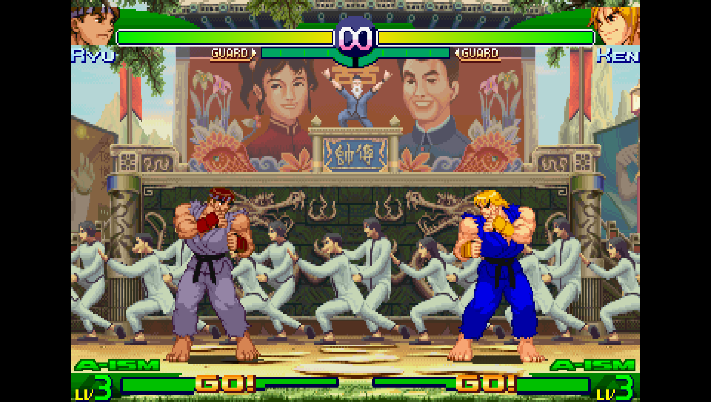
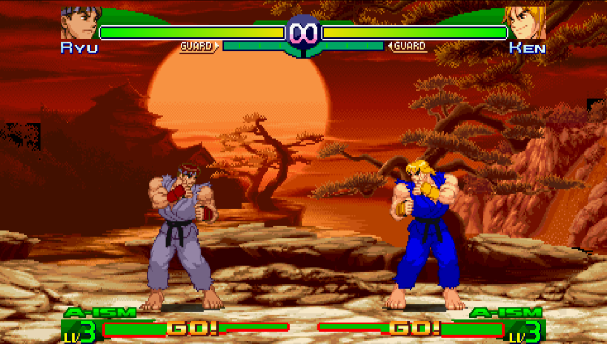

# SFA3 MAX — Patch widescreen 16:9 nativo (PSP)

> 🌐 [English](README.md) · [日本語](README.ja.md) · [Français](README.fr.md) · [Español](README.es.md) · **Português (BR)**

Patch widescreen **16:9 nativo (480×272)** para **Street Fighter Alpha 3 MAX** /
**Street Fighter Zero 3 Double Upper** no PSP.

A opção de tela interna do jogo precisa estar em **"Normal"** (4:3 sem esticar). Este
patch faz a engine renderizar o fundo **nativamente em 16:9**: a viewport é aberta para
os 480 px completos e as camadas de tiles do fundo são estendidas com **tiles reais do
estágio** à esquerda e à direita, **mantendo-se centralizadas** — sem esticar, sem
duplicação por renderização tripla.

## Antes / depois

| Original (4:3, pillarbox) | Com patch (16:9 nativo) |
|:---:|:---:|
|  |  |

| | |
|---|---|
| **Versão** | **1.1** |
| **Dumps suportados** | EU `ULES-00235` (v1.01) · US `ULUS-10062` · JP `ULJM-05082` (v1.01, Zero 3 Double Upper) |
| **Testado em** | PPSSPP |
| **Entrada** | um `EBOOT.BIN` **descriptografado** (ELF) |
| **Método** | patcher binário em Python puro, **pattern-scan** (sem offsets fixos) |

---

## O que faz

* **Abertura da viewport** — janela de render 384 → 480 px, pillarbox lateral removido.
* **Fundo em widescreen** — as três rotinas de desenho de tiles do fundo (camadas de
  16 px e 32 px) recebem colunas extras + um deslocamento à esquerda, para que o fundo
  preencha os 480 px **centralizado**.

### Novidades na v1.1

* **Camadas de cenário pintado / objetos** (templos, árvores, elementos de primeiro plano
  e a arte de título / menu / seleção de personagem — um pipeline de render separado que
  o patch v1.0 não tocava) agora são estendidas para 480 px em vez de cortadas nos
  antigos limites 4:3.
* **Correção do deslocamento vertical na emenda do wrap** — a v1.0 deslocava as camadas de
  tiles para a esquerda para preencher o lado ampliado, mas não ajustava o gatilho do
  rebobinamento, então a última coluna / a emenda de rolagem lia uma linha de tiles baixa
  demais (deslocamento de ~16 px para baixo). As três rotinas de desenho agora compensam
  o gatilho, e as emendas se alinham com exatidão.
* **Terceira rotina de tiles** (`FUN_177c8`) — a única rotina de tilemap que a v1.0
  deixava em 4:3 agora recebe o tratamento widescreen completo (contagem + deslocamento à
  esquerda + correção de emenda).

Os sprites dos personagens, o HUD e a jogabilidade não são alterados e permanecem
centralizados.

### Limitação conhecida

Nas **extremidades de um estágio** (onde a tilemap simplesmente não contém mais tiles)
pode restar uma pequena margem nessas raras posições de câmera. É um limite de *dados* do
estágio original, não de código. No meio do estágio o fundo é 16:9 completo.

---

## Início rápido (PPSSPP, EBOOT descriptografado)

```
python sfa3_ws_patternpatcher.py  EBOOT.BIN  EBOOT_WS.BIN
```

Depois execute `EBOOT_WS.BIN` (ou reempacote-o na ISO — veja abaixo) e coloque a opção de
tela interna do jogo em **Normal**.

O patcher se recusa a gravar se algo parecer errado (assinatura ausente/duplicada) e é
**idempotente** (ao reexecutar exibe `[skip]`).

---

## Instalação mais fácil — cheat do PPSSPP (sem descriptografar nem reempacotar)

Há cheats prontos em [`cheats/`](cheats/), um por região. Eles aplicam exatamente as
mesmas edições de memória que o patcher, continuamente em tempo de execução, então **não
é preciso descriptografar nem reempacotar nada** — basta colocar o arquivo e ativá-lo.

1. Copie `cheats/<DISC-ID>.ini` para `memstick/PSP/Cheats/` (ex.: `ULES00235.ini`).
2. PPSSPP: **Settings → System → Enable cheats**.
3. Inicie o jogo → **Pause → Cheats** → marque **"16:9 Widescreen (native, v1.1)"**.
4. Coloque a opção de tela interna do jogo em **Normal**.

> ⚠️ **Específico de versão.** Os endereços do cheat são fixos para os dumps listados
> acima (EU/JP **v1.01**). Uma revisão diferente desloca os endereços — nesse caso use o
> patcher Python, que localiza tudo por padrão e se adapta a qualquer revisão. (A revisão
> do seu dump aparece nas informações do jogo no PPSSPP, ou como `_1.0x` nos nomes dos
> save-states.)

---

## Fluxo completo: ISO → descriptografar → aplicar patch → reempacotar

O EBOOT dentro de uma ISO comercial é **criptografado** (cabeçalho `~PSP` / `PSAR`). Você
precisa descriptografá-lo primeiro. A recriptografia **não** é necessária para o PPSSPP.

### 1. Extrair e descriptografar o EBOOT (PPSSPP)

O PPSSPP pode despejar o EBOOT descriptografado para você:

1. **Settings → Tools → Developer tools** → ative
   **"Dump Decrypted EBOOT.BIN on game boot"**.
2. Inicie o jogo uma vez.
3. O arquivo descriptografado aparece em
   `memstick/PSP/SYSTEM/DUMP/<DISC-ID>_EBOOT.BIN`
   (ex.: `ULES00235_EBOOT.BIN`). Copie-o.

> Alternativamente, use o **PRXDecrypter** em um PSP real/emulado, que grava um
> `BOOT.BIN` descriptografado.

### 2. Aplicar o patch

```
python sfa3_ws_patternpatcher.py  ULES00235_EBOOT.BIN  EBOOT_WS.BIN
```

### 3. Reempacotar na ISO (UMDGen)

1. Abra a ISO original no **UMDGen**.
2. Vá até `PSP_GAME/SYSDIR/EBOOT.BIN`.
3. **Botão direito → Import / Replace file** e escolha `EBOOT_WS.BIN`.
   - O PPSSPP executa diretamente um EBOOT **descriptografado** colocado na ISO; não é
     preciso assinar para uso no emulador.
4. **File → Save As** para uma nova ISO.

> O uso em hardware real exige um EBOOT assinado (ex.: `sign_np`) e CFW; este guia é
> voltado ao PPSSPP.

### 4. Colocar a tela em Normal

No jogo: **Options → Display → Normal** (não "Wide"/esticado). O widescreen agora vem de
tiles realmente renderizados, não de esticamento.

---

## Arquivos

| Arquivo | Função |
|---|---|
| `sfa3_ws_patternpatcher.py` | o patcher (EU/US/JP, pattern-scan) |
| `cheats/<DISC-ID>.ini` | cheats do PPSSPP prontos (por região, sem reempacotar) |
| `README.md` | este arquivo — guia do usuário |
| `TECHNICAL.md` | documento completo de engenharia reversa: cada patch explicado |
| `LICENSE` | MIT (apenas o código do patcher); jogo © Capcom |

---

## Ferramentas usadas

| Ferramenta | Papel | Onde |
|---|---|---|
| **Python 3** | executa o patcher (apenas stdlib — sem `pip install`) | python.org |
| **PPSSPP** | dump de descriptografia do EBOOT · depuradores GE/CPU usados na engenharia reversa | ppsspp.org |
| **UMDGen** | reempacota o EBOOT corrigido na ISO | (ferramenta ISO do Windows) |
| **PRXDecrypter** | descriptografia de EBOOT alternativa em PSP real/CFW | (homebrew PSP) |
| **sign_np** | reassina o EBOOT para hardware real (desnecessário no PPSSPP) | (homebrew PSP) |

> Requisitos: **Python 3.8+**. Sem pacotes de terceiros — o patcher importa apenas `os`,
> `sys`, `struct` da biblioteca padrão.

---

## Créditos / notas

Engenharia reversa feita a partir do EBOOT descriptografado via desassembly MIPS estático
e os depuradores GE/CPU do PPSSPP. O patch é um conjunto de edições de instruções in loco
mais dois pequenos code-caves colocados em padding executável existente — sem mudança de
tamanho de arquivo.

Jogo original © Capcom.
